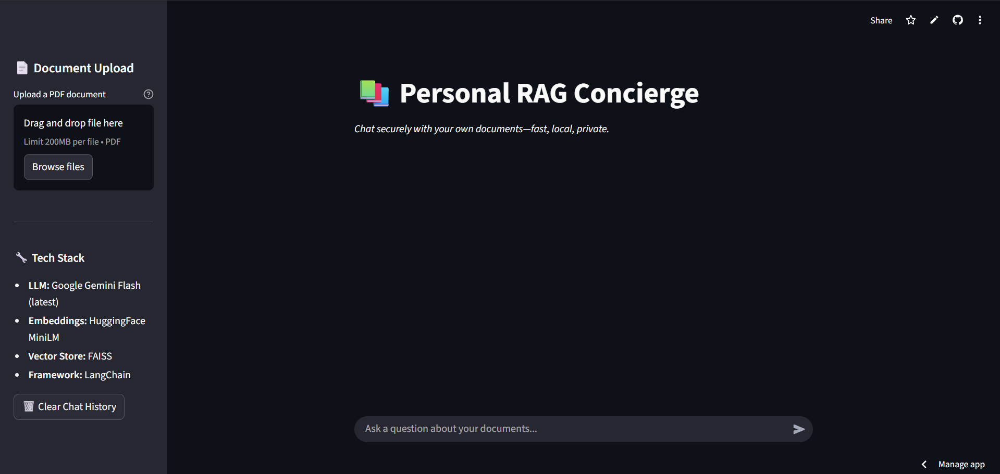

# Personal RAG Concierge 📚


> **Kaggle Community Hackathon:** Agents Intensive - Capstone Project  
> **Tagline:** *Chat securely with your own documents—fast, local, private.*

## 📖 Project Description

**Personal RAG Concierge** is a privacy-first AI agent that empowers users to chat with their own PDF documents using Retrieval-Augmented Generation (RAG). Unlike cloud-based solutions that upload your sensitive files to remote servers, this system keeps documents local while generating lightweight embeddings for semantic search.

Powered by **Google Gemini Flash** for blazing-fast inference and **FAISS** for efficient local vector storage, the agent provides grounded, context-aware answers in real-time. Built with **Streamlit**, it offers a clean, intuitive interface for document ingestion and conversational Q&A—perfect for researchers, students, and professionals who need instant insights from their personal knowledge base.

**How it works:**
1. Upload PDF documents via the Streamlit UI
2. Documents are chunked and embedded locally using HuggingFace's `all-MiniLM-L6-v2`
3. Embeddings are stored in a FAISS vector database (in-memory)
4. Ask natural language questions—the agent retrieves relevant context and generates grounded answers using Google Gemini
5. All processing happens locally except for LLM inference calls (only text queries are sent, never raw documents)

## ✨ Key Features

### 🔧 Multi-Agent Tooling
Custom-built ingestion and retrieval tools built with LangChain, enabling modular document processing and semantic search capabilities.

### 🧠 Session Memory
Maintains conversation context across multiple queries within a session, allowing for follow-up questions and deeper exploration of document content.

### ⚡ Google Gemini Powered
Leverages **Google Gemini Flash** (`gemini-flash-latest`) for sub-second reasoning and response generation, ensuring a smooth conversational experience.

### 🎨 Clean UI
Built with **Streamlit** for a modern, responsive interface that works seamlessly across desktop and mobile browsers. Features include:
- Drag-and-drop PDF upload
- Real-time chat interface
- Sidebar document management
- Chat history persistence per session
- Smart output parsing for clean responses

### 🔒 Privacy-First Architecture
- Documents remain on local storage during processing
- Only text embeddings (dense vectors) are stored—no raw document text is sent to external services
- FAISS vector store runs entirely in-memory or can be persisted locally
- API keys secured via environment variables

## 🛠️ Tech Stack

| Component | Technology |
|-----------|------------|
| **Frontend** | Streamlit |
| **LLM** | Google Gemini Flash (latest) |
| **Embeddings** | HuggingFace (`sentence-transformers/all-MiniLM-L6-v2`) |
| **Vector Store** | FAISS (CPU-optimized) |
| **Orchestration** | LangChain |
| **Document Processing** | PyPDF, RecursiveCharacterTextSplitter |
| **Language** | Python 3.11+ |

## 🚀 How to Run Locally

### Prerequisites
- Python 3.11 or higher
- Google API Key (get it from [Google AI Studio](https://aistudio.google.com/app/apikey))

### Installation Steps

1. **Clone the repository:**
```bash
git clone https://github.com/THEN01EXPLORER/personal-rag-agent.git
cd capstone
```

2. **Create and activate a virtual environment:**
```bash
python -m venv venv

# Windows (PowerShell)
venv\Scripts\Activate.ps1

# Windows (Command Prompt)
venv\Scripts\activate.bat

# Windows (Git Bash)
source venv/Scripts/activate

# macOS/Linux
source venv/bin/activate
```

3. **Install dependencies:**
```bash
pip install -r requirements.txt
```

4. **Set up environment variables:**

Create a `.env` file in the project root:
```env
GOOGLE_API_KEY=your_google_api_key_here
```

⚠️ **Important:** Never commit your `.env` file. It's already included in `.gitignore`.

5. **Run the application:**
```bash
streamlit run agent.py
```

The app will automatically open in your default browser at `http://localhost:8501`.

### Usage Flow

1. **Upload a PDF:** Use the sidebar file uploader to select a PDF document
2. **Ingest Document:** Click "📥 Ingest Document" to process and embed the content
3. **Ask Questions:** Type your questions in the chat input at the bottom
4. **Get Grounded Answers:** The agent retrieves relevant context and provides accurate responses

### Example Session
```
User: What are the main findings in the research paper?
Agent: Based on the ingested document, the main findings include...

User: Can you elaborate on the methodology used?
Agent: The methodology section describes a three-phase approach...
```

## 🌐 Deployment to Streamlit Cloud

### Step-by-Step Deployment

1. **Push your code to GitHub:**
```bash
git add .
git commit -m "Ready for deployment"
git push origin main
```

2. **Deploy to Streamlit Cloud:**
   - Go to [share.streamlit.io](https://share.streamlit.io/)
   - Click "New app"
   - Select your repository, branch (`main`), and main file (`agent.py`)
   - Click "Deploy"

3. **Add API Key as a Secret:**
   - In your Streamlit Cloud dashboard, go to your app settings
   - Navigate to "Secrets"
   - Add your secret in TOML format:
   ```toml
   GOOGLE_API_KEY = "your_google_api_key_here"
   ```
   - Save and reboot the app

4. **Access your deployed app:**
   - Your app will be available at `https://[your-app-name].streamlit.app`

### Environment Variables
For local development, use a `.env` file. For Streamlit Cloud, use the Secrets management feature as shown above.

## 🎥 Demo

### 🌐 Live Deployment
🚀 **[Try the Live App](https://agentpy-gzmxf4kwamofut5acnf3v5.streamlit.app/)**

### 🎬 Video Demo
🔗 **[Watch Demo Video](https://youtu.be/1U8ETtSHhR4)**

### 📸 Screenshots


*Main interface showing document upload, tech stack, and chat interface*

## 📁 Project Structure

```
capstone/
├── agent.py                          # Main Streamlit application
├── requirements.txt                   # Python dependencies
├── .env                              # Environment variables (local only, not committed)
├── .gitignore                        # Git ignore rules
├── README.md                         # Project documentation
├── python-rag-agent-project/         # Additional RAG implementation modules
│   ├── agent.py                      # Alternative agent implementation
│   ├── tools/
│   │   └── document_tool.py          # Document processing tools
│   └── rag/
│       ├── embeddings.py             # Embedding utilities
│       ├── vectorstore.py            # Vector store management
│       ├── loader.py                 # Document loaders
│       ├── chain.py                  # RAG chain implementation
│       └── config.py                 # Configuration management
└── tools/
    └── document_tool.py              # Shared document tools
```

## 🔒 Security & Privacy Considerations

### Data Handling
- **Local Processing:** PDF documents are processed locally and temporarily stored only during ingestion
- **Embedding Storage:** Only vectorized embeddings are retained—no raw document text is stored long-term
- **API Communication:** Only user queries and retrieved context snippets are sent to Google Gemini API

### Best Practices
- Never commit your `.env` file or API keys to version control
- Use environment variables for all sensitive credentials
- For production deployments, consider:
  - Adding authentication/authorization
  - Implementing rate limiting
  - Using encrypted storage for persistent vector databases
  - Deploying behind a VPN for internal use cases

### Compliance Notes
⚠️ **Important:** Do not ingest sensitive, proprietary, or regulated documents (HIPAA, GDPR-protected, classified information) without implementing appropriate additional safeguards. This prototype is designed for demonstration purposes.

## 🎯 Use Cases

- **Academic Research:** Query research papers, theses, and academic literature
- **Legal Document Review:** Search through contracts, case files, and legal briefs
- **Technical Documentation:** Navigate API docs, user manuals, and technical specifications
- **Personal Knowledge Management:** Build a searchable archive of articles, notes, and reports
- **Business Intelligence:** Analyze market reports, financial statements, and business plans

## 🔮 Future Enhancements

### Planned Features
- [ ] **Persistent Vector Store:** Save FAISS index to disk for cross-session document retention
- [ ] **Multi-format Support:** Add support for DOCX, TXT, Markdown, and web scraping
- [ ] **Source Citations:** Display page numbers and document names in answers
- [ ] **Advanced Reranking:** Implement hybrid search (BM25 + semantic) for improved retrieval
- [ ] **Authentication:** Add user login and document isolation for multi-user deployments
- [ ] **Observability:** Integrate tracing and metrics (LangSmith, Weights & Biases)
- [ ] **API Endpoint:** Expose REST API for programmatic access
- [ ] **Batch Processing:** Support folder uploads and bulk document ingestion

### Extensibility
The modular architecture makes it easy to swap components:
- **LLM:** Replace Gemini with Groq, OpenAI, or Anthropic
- **Embeddings:** Use OpenAI embeddings, Cohere, or fine-tuned models
- **Vector Store:** Migrate to Pinecone, Weaviate, or Qdrant for production scale
- **UI:** Build a React frontend or mobile app using the core RAG logic

## 🤝 Contributing

Contributions are welcome! Please feel free to submit a Pull Request. For major changes:
1. Fork the repository
2. Create a feature branch (`git checkout -b feature/AmazingFeature`)
3. Commit your changes (`git commit -m 'Add some AmazingFeature'`)
4. Push to the branch (`git push origin feature/AmazingFeature`)
5. Open a Pull Request

## 📄 License

This project is licensed under the MIT License - see the LICENSE file for details.

## 🏆 Hackathon Submission

**Competition:** Kaggle Community Hackathon - Agents Intensive Capstone Project

### Why Personal RAG Concierge Stands Out

1. **Real User Value:** Solves a genuine pain point—instant Q&A over personal documents without cloud upload friction
2. **Performance:** Google Gemini Flash delivers sub-second responses with high-quality reasoning
3. **Privacy-First:** Documents stay local; only embeddings are generated for search
4. **Production-Ready Architecture:** Modular design with clear separation of concerns
5. **Clean UX:** Intuitive Streamlit interface requires zero learning curve

### Technical Highlights
- **Complete RAG Pipeline:** Full implementation of chunking, embedding, retrieval, and generation
- **LangChain Integration:** Leverages industry-standard orchestration framework
- **Local Embeddings:** HuggingFace SentenceTransformers run on CPU—no GPU required
- **Session Management:** Maintains conversation context for follow-up queries
- **Smart Output Parsing:** Automatically cleans nested response structures from LLM

### Innovation Points
- **Zero-config Setup:** Works out of the box with just an API key
- **Cost-effective:** Uses free Google Gemini API and local embeddings (no paid vector DB)
- **Extensible Design:** Easy to swap LLMs, embeddings, or vector stores
- **Educational Value:** Clean, readable code demonstrating RAG best practices

## 🐛 Troubleshooting

| Issue | Cause | Solution |
|-------|-------|----------|
| `GOOGLE_API_KEY not found` | Missing or incorrect `.env` file | Verify `.env` exists in project root with correct key |
| Slow first run | Model downloads on initial use | Subsequent runs are much faster; models are cached |
| Empty/irrelevant answers | Document not properly ingested | Re-upload PDF and ensure "✅ Successfully ingested" message appears |
| Unicode errors during PDF load | Malformed or encrypted PDF | Try re-saving the PDF or converting to text-based PDF |
| Out of memory error | Very large PDFs | Split document into smaller files or increase system RAM |
| Model not found (404) | Outdated model name | Verify code uses `gemini-flash-latest` |

### Getting Help
- Check the [Issues](https://github.com/THEN01EXPLORER/personal-rag-agent/issues) page
- Review the [LangChain documentation](https://python.langchain.com/)
- Consult the [Streamlit docs](https://docs.streamlit.io/)

## 📧 Contact

**Project Repository:** [personal-rag-agent](https://github.com/THEN01EXPLORER/personal-rag-agent)  
**GitHub:** [@THEN01EXPLORER](https://github.com/THEN01EXPLORER)

---

**Built with ❤️ for Kaggle Agents Intensive - Capstone Project**

*Star ⭐ this repo if you find it useful!*
